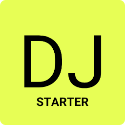

<p align="center">
  
</p>

# django-starter 🚀
Starter code for your Django projects


## Features

- Django 4.2.5
- Install via [Pip](https://pypi.org/project/pip/)
- User log in/out, sign up, password reset via [django-allauth](https://github.com/pennersr/django-allauth)
- Static files configured with [Whitenoise](http://whitenoise.evans.io/en/stable/index.html)
- Debugging with [django-debug-toolbar](https://github.com/jazzband/django-debug-toolbar)
- Custom 404, 500, and 403 error pages
----

## Installation
DJSTARTER can be installed via Pip. To start, clone the repo to your local computer and change into the proper directory.


### Pip

```
$ python -m venv .venv

$ source .venv/bin/activate

(.venv) $ pip install -r requirements.txt
(.venv) $ python manage.py migrate
(.venv) $ python manage.py createsuperuser
(.venv) $ python manage.py runserver
# Load the site at http://127.0.0.1:8000
```


## Next Steps

- Add environment variables. There are multiple packages, but I personally prefer [Python Decouple](https://pypi.org/project/python-decouple/).
- Update the [EMAIL_BACKEND](https://docs.djangoproject.com/en/dev/topics/email/#module-django.core.mail) and connect with a mail provider.